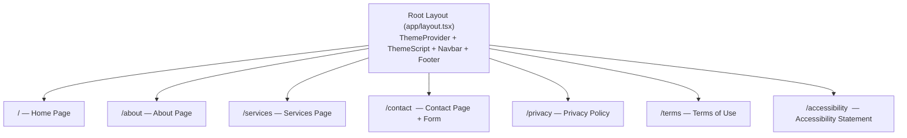

# Technical Architecture Document

## 1. Overview

Apex Digital Consulting is a frontend-only marketing and services website built with Next.js 16 (App Router), React 19, TypeScript, and Tailwind CSS 4, deployed to Vercel. The architecture is a server-rendered monolith with static and server-rendered pages, a single Server Action for the contact form email flow, and no database or authentication layer. The site uses a component-based architecture with shared UI components, a CSS custom property-based design token system for light/dark theming, and a mobile-first responsive layout.

**Key architectural patterns:**

- **Server Components by default** — All page components are React Server Components unless client interactivity is required (theme switcher, mobile nav toggle, contact form)
- **Feature-per-route** — Each feature page maps directly to a Next.js App Router route
- **Shared layout shell** — A root layout provides the Navbar and Footer across all pages, with a ThemeProvider wrapping the application for dark/light mode support
- **Design token theming** — Colors, typography, spacing, and elevation are defined as CSS custom properties, consumed by Tailwind CSS 4's `@theme` directive, and swapped between light/dark via a `data-theme` attribute on `<html>`
- **Server Action for contact** — The contact form submits via a Next.js Server Action that calls the Resend API to send email notifications

**System boundaries:**

- **In-scope:** All pages (Home, About, Services, Contact), shared layout components (Navbar, Footer), theme system, contact form with server-side email
- **External services:** Resend (transactional email for contact form submissions)
- **No backend:** No database, no authentication, no user accounts, no API layer beyond the single contact form Server Action

This architecture serves all 8 defined features: Home Page, About Page, Services Page, Contact Page, Responsive Navbar, Site Footer, Theme Switcher, and Contact Form.

## 2. Project Structure

### Directory Layout

```
project-root/
├── src/
│   ├── app/                        # Next.js App Router — routes and layouts
│   │   ├── layout.tsx              # Root layout (html, body, fonts, ThemeProvider, Navbar, Footer)
│   │   ├── page.tsx                # Home page (/)
│   │   ├── about/
│   │   │   └── page.tsx            # About page (/about)
│   │   ├── services/
│   │   │   └── page.tsx            # Services page (/services)
│   │   ├── contact/
│   │   │   └── page.tsx            # Contact page (/contact)
│   │   ├── privacy/
│   │   │   └── page.tsx            # Privacy policy placeholder (/privacy)
│   │   ├── terms/
│   │   │   └── page.tsx            # Terms of use placeholder (/terms)
│   │   ├── accessibility/
│   │   │   └── page.tsx            # Accessibility statement placeholder (/accessibility)
│   │   ├── actions/
│   │   │   └── contact.ts          # Server Action: contact form email via Resend
│   │   ├── globals.css             # Global styles, design tokens, Tailwind imports
│   │   ├── sitemap.ts              # Dynamic sitemap generation
│   │   ├── robots.ts               # Robots.txt configuration
│   │   └── favicon.ico             # Site favicon
│   ├── components/                 # Shared UI components
│   │   ├── Navbar.tsx              # Responsive navigation bar (client component)
│   │   ├── Footer.tsx              # Site footer (server component)
│   │   ├── ThemeProvider.tsx        # Theme context provider (client component)
│   │   ├── ThemeToggle.tsx          # Light/dark mode toggle button (client component)
│   │   ├── ThemeScript.tsx          # Inline script to prevent FOUC (server component)
│   │   ├── ContactForm.tsx          # Reusable contact form (client component)
│   │   ├── SectionContainer.tsx     # Max-width centered content wrapper (server component)
│   │   └── CallToAction.tsx         # CTA section for conversion pages (server component)
│   ├── lib/                        # Shared utilities and configuration
│   │   ├── navigation.ts           # Navigation link definitions (single source of truth)
│   │   ├── site-config.ts          # Site-wide constants (business name, tagline, contact info)
│   │   └── validation.ts           # Form validation utilities
│   └── types/                      # Shared TypeScript type definitions
│       └── index.ts                # Common types (ContactFormData, NavLink, etc.)
├── tests/                          # Unit and integration tests (mirrors src/)
│   ├── setup.ts                    # Vitest global setup (IS_REACT_ACT_ENVIRONMENT, etc.)
│   ├── components/
│   │   ├── Navbar.spec.tsx
│   │   ├── Footer.spec.tsx
│   │   ├── ThemeToggle.spec.tsx
│   │   ├── ContactForm.spec.tsx
│   │   ├── SectionContainer.spec.tsx
│   │   └── CallToAction.spec.tsx
│   ├── app/
│   │   ├── page.spec.tsx           # Home page
│   │   ├── about/
│   │   │   └── page.spec.tsx
│   │   ├── services/
│   │   │   └── page.spec.tsx
│   │   └── contact/
│   │       └── page.spec.tsx
│   ├── lib/
│   │   └── validation.spec.ts
│   └── fixtures/                   # Shared test data
│       └── contact-form.ts
├── cypress/                        # E2E tests
│   ├── e2e/
│   │   ├── home.cy.ts
│   │   ├── about.cy.ts
│   │   ├── services.cy.ts
│   │   ├── contact.cy.ts
│   │   ├── navigation.cy.ts       # Navbar + footer navigation flows
│   │   └── theme.cy.ts            # Theme switching flows
│   ├── support/
│   │   ├── commands.ts
│   │   └── e2e.ts
│   └── tsconfig.json
├── __mocks__/                      # Module mocks for Vitest
├── public/                         # Static assets served via Vercel CDN
│   └── favicon.ico
├── gspec/                          # Specification documents
├── .env.example                    # Environment variable template
├── .env.local                      # Local environment variables (gitignored)
├── .gitignore
├── .husky/                         # Git hooks
│   └── pre-commit                  # Runs lint-staged
├── .lintstagedrc.json              # lint-staged config (ESLint + Prettier on staged files)
├── .prettierrc.json                # Prettier configuration
├── cypress.config.ts               # Cypress E2E configuration
├── eslint.config.mjs               # ESLint configuration
├── next-env.d.ts                   # Next.js TypeScript declarations
├── next.config.ts                  # Next.js configuration
├── package.json
├── pnpm-lock.yaml
├── pnpm-workspace.yaml
├── postcss.config.mjs              # PostCSS with Tailwind CSS plugin
├── tsconfig.json                   # TypeScript configuration
└── vitest.config.ts                # Vitest configuration
```

### File Naming Conventions

- **React components:** `PascalCase.tsx` (e.g., `Navbar.tsx`, `ContactForm.tsx`)
- **Utility/config files:** `kebab-case.ts` (e.g., `site-config.ts`, `validation.ts`)
- **Type definition files:** `kebab-case.ts` or `index.ts` in a `types/` directory
- **Unit/integration test files:** `[filename].spec.ts` or `[filename].spec.tsx` in `tests/` directory, mirroring `src/` structure
- **E2E test files:** `[page-name].cy.ts` in `cypress/e2e/`
- **Next.js conventions:** `page.tsx`, `layout.tsx`, `sitemap.ts`, `robots.ts` (framework-dictated names)

### Key File Locations

| Purpose | Location |
|---|---|
| Entry point / root layout | `src/app/layout.tsx` |
| Route definitions | `src/app/*/page.tsx` (file-system routing) |
| Global styles & design tokens | `src/app/globals.css` |
| Site-wide configuration | `src/lib/site-config.ts` |
| Navigation link definitions | `src/lib/navigation.ts` |
| Contact form Server Action | `src/app/actions/contact.ts` |
| Vitest configuration | `vitest.config.ts` |
| Cypress configuration | `cypress.config.ts` |
| Environment variable template | `.env.example` |

## 3. Data Model

**Not Applicable** — This is a frontend-only site with no database. All content is statically coded into page components. The only structured data that flows through the system is the contact form submission payload.

### Contact Form Payload

The contact form sends a structured payload to the Server Action. This is the sole data contract in the application:

```typescript
// src/types/index.ts

interface ContactFormData {
  name: string;        // Required, visitor's full name
  email: string;       // Required, valid email format
  phone: string;       // Optional, visitor's phone number
  message: string;     // Required, inquiry body text
  honeypot: string;    // Hidden field — must be empty for legitimate submissions
}

interface ContactFormResult {
  success: boolean;
  error?: string;      // Human-readable error message on failure
}
```

**Introduced by:** [Contact Form](features/contact-form.md)

## 4. API Design

### Server Action (not a REST API)

The contact form uses a Next.js Server Action rather than an API route. This is the only server-side endpoint in the application.

```
## Contact Form Submission
Server Action: src/app/actions/contact.ts

Function: submitContactForm(formData: ContactFormData) → ContactFormResult

- Validates input server-side (name, email, message required; honeypot must be empty)
- Sends email via Resend SDK to CONTACT_EMAIL_TO
- Returns { success: true } on success
- Returns { success: false, error: "..." } on failure
```

### Request/Response Conventions

Since this is a Server Action (not a REST API), there is no HTTP envelope. The function returns a typed `ContactFormResult` directly. Error handling follows this pattern:

- **Validation failure:** Return `{ success: false, error: "Please fill in all required fields." }`
- **Honeypot triggered:** Return `{ success: true }` silently (don't reveal spam detection)
- **Resend API failure:** Return `{ success: false, error: "Something went wrong — please try again or contact us directly." }`
- **Unexpected error:** Return `{ success: false, error: "Something went wrong — please try again or contact us directly." }`

### Validation Patterns

- **Client-side:** The `ContactForm` component validates before calling the Server Action (required fields, email format). Validation logic lives in `src/lib/validation.ts` and is shared between client and server.
- **Server-side:** The Server Action re-validates all input before sending email. This is the authoritative validation — client-side validation is a UX convenience only.

## 5. Page & Component Architecture

### Page Map

| Route | Page | Feature PRD |
|---|---|---|
| `/` | Home Page | [home-page.md](features/home-page.md) |
| `/about` | About Page | [about-page.md](features/about-page.md) |
| `/services` | Services Page | [services-page.md](features/services-page.md) |
| `/contact` | Contact Page | [contact-page.md](features/contact-page.md) + [contact-form.md](features/contact-form.md) |
| `/privacy` | Privacy Policy | Legal placeholder (footer link target) |
| `/terms` | Terms of Use | Legal placeholder (footer link target) |
| `/accessibility` | Accessibility Statement | Legal placeholder (footer link target) |

### Page & Layout Hierarchy



### Shared Components

| Component | Type | Purpose | Used By |
|---|---|---|---|
| `Navbar` | Client | Responsive navigation bar with hamburger menu and theme toggle | Root layout (all pages) |
| `Footer` | Server | Site footer with identity, nav links, legal links, copyright | Root layout (all pages) |
| `ThemeProvider` | Client | React context for theme state management | Root layout |
| `ThemeToggle` | Client | Light/dark toggle button with sun/moon icons | Navbar |
| `ThemeScript` | Server | Inline `<script>` to set theme before paint (prevents FOUC) | Root layout `<head>` |
| `ContactForm` | Client | Reusable contact form with validation and submission | Contact page |
| `SectionContainer` | Server | Max-width centered container with horizontal padding | All content pages |
| `CallToAction` | Server | CTA section directing visitors to contact page | Home page, Services page |

### Component Patterns

**Server vs. Client Components:**
- Default to Server Components for all page and layout content
- Use `"use client"` only where browser APIs or interactivity are required:
  - `ThemeProvider` — uses `useState`, `useEffect`, `localStorage`
  - `ThemeToggle` — click handler for theme switching
  - `Navbar` — mobile menu toggle state
  - `ContactForm` — form state, validation, submission handling

**Data Fetching:**
- No external data fetching — all page content is static and coded directly into components
- The contact form Server Action is the only server-side operation

**Form Handling:**
- `ContactForm` uses React 19's `useActionState` hook with the `submitContactForm` Server Action
- Client-side validation runs on submit before calling the action
- Loading state derived from `useActionState` pending status

**Error Boundaries:**
- Next.js built-in `error.tsx` for route-level error handling
- Contact form handles its own error state internally via the `ContactFormResult` return value

**Loading States:**
- Contact form shows a loading spinner/disabled state during submission
- No other loading states needed (all pages are static server-rendered content)

## 6. Service & Integration Architecture

### Internal Services

There is no service layer — the application is a static marketing site. The only business logic is:

1. **Contact form validation** (`src/lib/validation.ts`) — shared validation functions used by both the client-side form and the Server Action
2. **Contact form email send** (`src/app/actions/contact.ts`) — Server Action that validates input and calls Resend

### External Integrations

| Service | Purpose | Integration Point |
|---|---|---|
| **Resend** | Transactional email for contact form | `resend` npm package, called from Server Action |
| **Google Fonts** | Inter font family | Next.js `next/font/google` (automatic optimization) |
| **HeroIcons** | SVG icon library | `@heroicons/react` npm package, tree-shaken imports |

**Resend Integration Pattern:**
```typescript
// In src/app/actions/contact.ts
import { Resend } from "resend";

const resend = new Resend(process.env.RESEND_API_KEY);

// Called within the Server Action after validation passes
await resend.emails.send({
  from: "Apex Digital <noreply@apexdigitalconsulting.com>",
  to: process.env.CONTACT_EMAIL_TO,
  subject: `New inquiry from ${name}`,
  text: `Name: ${name}\nEmail: ${email}\nPhone: ${phone || "Not provided"}\n\nMessage:\n${message}`,
});
```

### Background Jobs / Events

Not applicable — no async processing, queues, or event-driven flows.

## 7. Authentication & Authorization Architecture

**Not Applicable** — No authentication or authorization is required. All pages are public. The only protected operation is the Server Action for contact form submission, which is protected by honeypot spam prevention only.

## 8. Environment & Configuration

### Environment Variables

```
# ─── Application ──────────────────────────────────
NEXT_PUBLIC_SITE_URL=https://apexdigitalconsulting.com   # Public site URL (used in metadata, sitemap)

# ─── Email (Contact Form via Resend) ─────────────
RESEND_API_KEY=re_xxxxxxxxxxxx                           # Secret — Resend API key
CONTACT_EMAIL_TO=hello@apexdigitalconsulting.com         # Non-secret — recipient email for form submissions
```

| Variable | Secret? | Required? | Description |
|---|---|---|---|
| `NEXT_PUBLIC_SITE_URL` | No | Yes | Public-facing site URL for metadata and sitemap |
| `RESEND_API_KEY` | **Yes** | Yes | Resend API key for sending contact form emails |
| `CONTACT_EMAIL_TO` | No | Yes | Email address that receives contact form submissions |

### Configuration Files

| File | Purpose | Notes |
|---|---|---|
| `next.config.ts` | Next.js framework configuration | Default settings sufficient for initial launch |
| `tsconfig.json` | TypeScript compiler options | Strict mode enabled; `@/*` path alias maps to `./src/*`; excludes `tests/` and `cypress/` |
| `eslint.config.mjs` | ESLint flat config | `eslint-config-next` with core-web-vitals and TypeScript rules |
| `postcss.config.mjs` | PostCSS plugins | Tailwind CSS 4 plugin |
| `vitest.config.ts` | Vitest test runner config | jsdom environment, path aliases, setup file |
| `cypress.config.ts` | Cypress E2E config | Base URL `http://localhost:3000`, headless by default |
| `.prettierrc.json` | Prettier formatting rules | Consistent with ESLint config |
| `.lintstagedrc.json` | lint-staged file patterns | Run ESLint + Prettier on staged `.ts`/`.tsx` files |

### Project Setup

Step-by-step commands to initialize and run the project from scratch:

```bash
# 1. Install dependencies
pnpm install

# 2. Copy environment variables
cp .env.example .env.local
# Edit .env.local with actual values (RESEND_API_KEY, etc.)

# 3. Run development server
pnpm dev

# 4. Run linting
pnpm lint

# 5. Run type checking
pnpm typecheck

# 6. Run unit/integration tests
pnpm test

# 7. Run E2E tests (headless)
pnpm test:e2e

# 8. Production build
pnpm build
```

**Key packages to install (by category):**

| Category | Packages |
|---|---|
| Framework | `next`, `react`, `react-dom` (already installed) |
| Styling | `tailwindcss`, `@tailwindcss/postcss` (already installed) |
| Icons | `@heroicons/react` |
| Email | `resend` |
| Fonts | Via `next/font/google` (no additional package) |
| Testing (unit) | `vitest`, `@testing-library/react`, `@testing-library/jest-dom`, `@testing-library/user-event`, `jsdom` |
| Testing (E2E) | `cypress` |
| Code quality | `prettier`, `husky`, `lint-staged` |

## 9. Open Decisions & Assumptions

### Assumptions Made

1. **Legal placeholder pages** — Privacy policy, terms of use, and accessibility statement pages are created as minimal placeholders with a heading and a short note indicating the content is forthcoming. This satisfies the footer's need for link targets without blocking development on legal copy.

2. **Resend `from` address** — The architecture assumes `noreply@apexdigitalconsulting.com` as the sender. This requires DNS verification in Resend's dashboard. If the domain is not yet verified, Resend's default `onboarding@resend.dev` sender can be used for development and testing.

3. **Inter font via next/font** — The style guide specifies Inter as the primary font. The current scaffold uses Geist. The architecture assumes replacing Geist with Inter via `next/font/google` during implementation.

4. **No JetBrains Mono initially** — The style guide mentions JetBrains Mono for code/technical content, but no features require code display. System monospace fallback is used unless code-display features are added later.

5. **Single shared navigation config** — Both the Navbar and Footer draw navigation links from `src/lib/navigation.ts` to prevent drift between header and footer navigation.

6. **Theme persistence via localStorage** — The theme switcher uses `localStorage` for preference persistence. No cookie-based approach is used since there is no SSR personalization need.

7. **`tsconfig.json` excludes** — Per project memory, `tsconfig.json` excludes `tests/` and `cypress/` directories to avoid type conflicts between Vitest/Cypress globals and application code. Test directories have their own tsconfig if needed.

### Areas That May Evolve

- **Blog or content section** — The product roadmap mentions content marketing. If a blog is added, it would introduce a `src/app/blog/` route group and potentially MDX or a headless CMS integration.
- **Product pages** — When Apex launches owned software products, the site may need product landing pages, pricing tables, or demo sections.
- **Analytics** — Vercel Analytics or a third-party tool may be added post-launch for traffic and Core Web Vitals monitoring.
